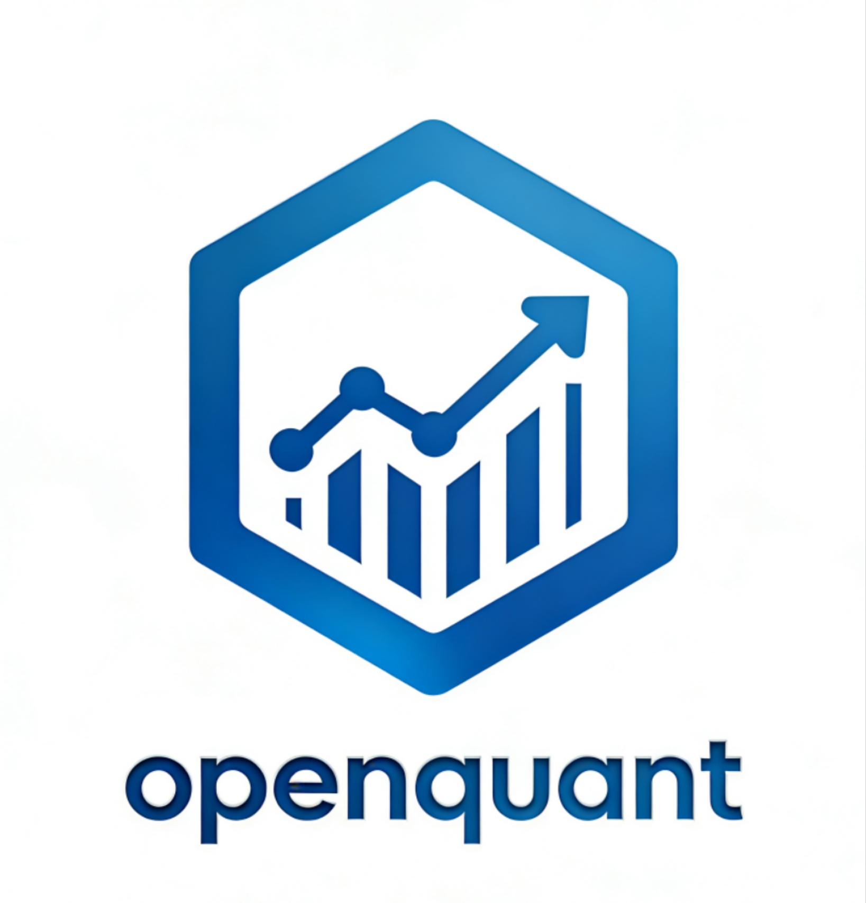
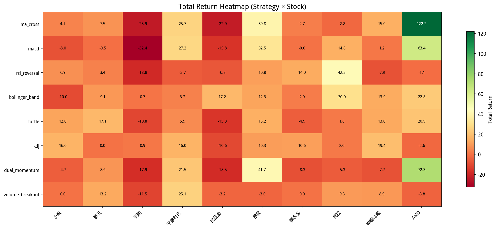
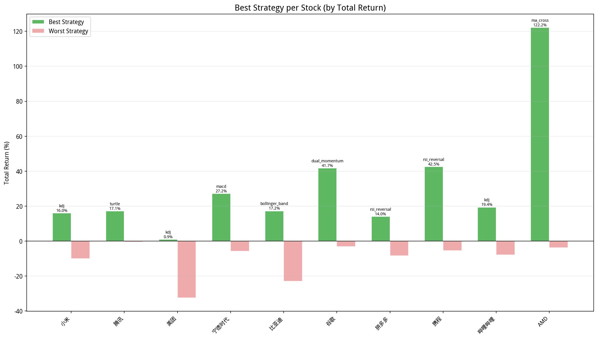

# openquant

<p align="center">
  
</p>

Personal quantitative trading system, hoping to achieve financial freedom...

## 1. Installation
```bash
git clone https://github.com/xsank/openquant.git
cd openquant
pip install -r requirements.txt
``` 

## 2. Usage

### 2.1 Backtest
```python
python -m openquant.main optimize \
  --symbol 09988 --start-date 2025-01-01 --end-date 2026-01-01 \
  --strategy ma_cross \
  --params short_window:int:3:20:1 long_window:int:10:60:5 \
  --target-metric sharpe_ratio --search-method grid --top-n 10 \
  --market hk_stock 
```

the result is as follows:
```text
============================================================
  策略: MA_Cross(14,15)
============================================================
  初始资金:           100,000.00
  最终权益:           146,862.18
  总收益率:               46.86%
  年化收益率:             48.25%
  年化波动率:             24.31%
  夏普比率:               1.8614
  索提诺比率:             2.3994
  卡玛比率:               5.2590
  最大回撤:               -9.17%
  最大回撤天数:               32
  胜率:                   15.10%
  盈亏比:                 2.1788
  交易次数:                   34
  总佣金:               1,077.18
============================================================
```

### 2.2 Simulate
```python
python -m openquant.main simulate \
  --symbols 09988 --strategy ma_cross \
  --datasource akshare --market hk_stock \
  --capital 100000 --interval 5 --max-rounds 3
```

Warning! you should know exactly what you are doing!

### 2.3 Batch Analysis

Support batch backtesting of multiple targets × multiple strategies, and automatically generate comparison charts:

```bash
python -m openquant.main batch_backtest \
  --stocks \
    hk_stock:01810:小米 \
    hk_stock:00700:腾讯 \
    hk_stock:03690:美团 \
    a_share:300750:宁德时代 \
    a_share:002594:比亚迪 \
    us_stock:105.GOOG:谷歌 \
    us_stock:105.PDD:拼多多 \
    us_stock:105.TCOM:携程 \
    us_stock:105.BILI:哔哩哔哩 \
    us_stock:105.AMD:AMD \
  --start-date 2025-01-01 \
  --end-date 2026-01-01 \
  --datasource akshare \
  --capital 100000 \
  --output-dir output/charts
```
or  
```bash
bash batch_backtest.sh
```

## 3. Backtest Results (2025-01-01 ~ 2026-01-01)

The following are 10 stocks including Hong Kong stocks (小米, 腾讯, 美团), A-shares (CATL, 比亚迪), and US stocks (谷歌, 拼多多, 携程, 哔哩哔哩, AMD). Analysis of the backtest results using eight strategies (MA Cross, MACD, RSI Reversal, Bollinger Band, Turtle, KDJ, Dual Momentum, Volume Breakout).

### 3.1 Return Heatmap

The yield heat map shows the total yield performance of each strategy on each asset. The greener the color, the higher the return; the redder the color, the greater the loss:

<p align="center">
  
</p>

### 3.2 Best Strategy per Stock

Comparison of the returns of the best and worst strategies for each target:

<p align="center">
  
</p>

**Key Findings:**

| Stock | Best Strategy | Return |
|-------|--------------|--------|
| AMD | MA Cross | +122.20% |
| 携程 | RSI Reversal | +42.53% |
| 谷歌 | Dual Momentum | +41.74% |
| 宁德时代 | MACD | +27.19% |
| 哔哩哔哩 | KDJ | +19.38% |
| 比亚迪 | Bollinger Band | +17.25% |
| 腾讯 | Turtle | +17.15% |
| 小米 | KDJ | +16.03% |
| 拼多多 | RSI Reversal | +14.02% |
| 美团 | KDJ | +0.93% |
